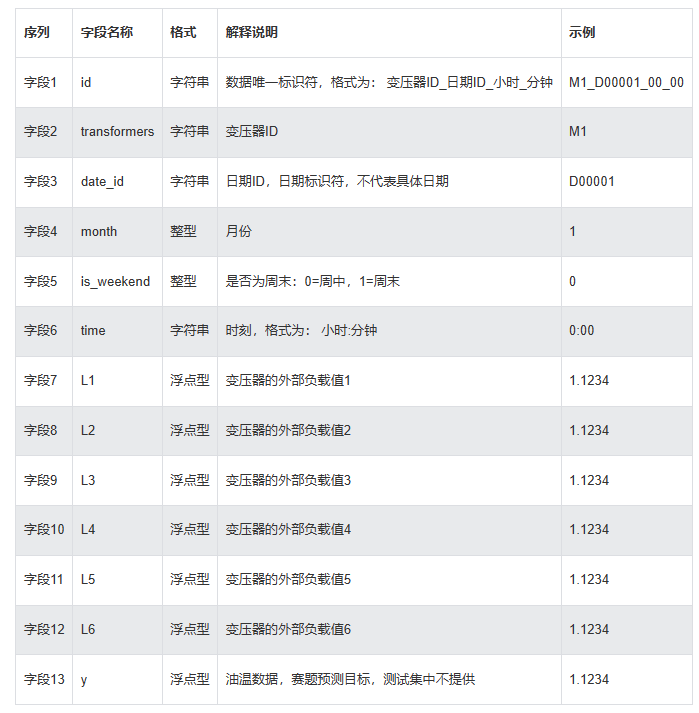
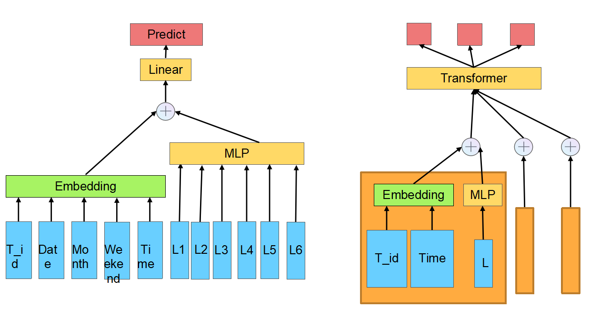

# [GAIDC比赛](https://www.heywhale.com/org/tbudf/competition/area/63be011bde6c0e9cdb12b965/content/2)baseline模型

## 1.赛题任务

##### 本赛题旨在探索油温与变压器运行的季节月份、时刻、外部负载等信息之间的关系。选手通过分析结构化的赛题数据，建立模型以**预测目标记录的油温**。

## 2.数据介绍

##### 数据每一个特征具体含义如下所示，其中有字符串类型的时间特征，也有相关的时间序列特征（L1-L6）,具体数据可视化分析参看ipynp文件

## 3.模型构建

##### 模型架构包含两种结构，一种是单纯的MLP结构，如左图所示，对于类别型特征时间、以及transformer id等先经过embedding进行稀疏化，对于时间序列特征直接使用MLP进行编码，最后将两种特征做一种简单的融合，并通过一个线形层之后用于预测，这种是单步预测（也就是一个点一个点的进行预测，忽略了一个周期内的相关性）；另外是引入transformer编码器，因为时序数据之间存在一定的相关性，这里是按照一天来进行构建序列的，将所有特征先按序列进行划分，处理特征方式与前面一致，然后使用transformer作为encoder获取输出

## 4.实验结果

##### 数据特征是在将每一个序列的数据中方差和均值加入到该序列中，也即a=a+mean(a)+var(a)

##### 对比学习是将每一个序列都随机做一次[数据增强](https://github.com/QinHsiu/Trick/tree/main/data_augmentation)来构造对比视图，a0=aug0(a),a1=aug1(a)，其中aug0和aug1操作是从'reorder','crop','mask'中随机选择的两种操作

| 数据\|模型    | MLP       | Transformer | Transformer+数据特征 | Transformer+数据特征+对比学习 |
| ------------- | --------- | ----------- | -------------------- | ----------------------------- |
| 训练集100*MAE | 6227401.5 | 491.07      | 431.26               | 481.97                        |
| 验证集100*MAE | 488.3     | 429.93      | 420.99               | 431.76                        |

##### 对比MLP的结果和Transformer的结果可以发现使用transformer要好于单一地使用MLP，另外在引入数据特征的时候效果最佳，这可能是因为一段时间内L1-L6的波动不能很好拟合需要预测的时间序列，为每一个值引入平均值和方差可以减少这种噪声，从而提升模型的效果，另外加入对比学习会使得模型的效果下降，这可能是因为使用随机数据增强虽然能够去掉一部分原始序列中的噪音，但是破坏时间数据之间的连贯性也可能会引入更多的噪音，从而破坏模型的效果

## 5. 运行方法

##### 进入到src文件夹之下，然后运行以下命令即可

`python main.py --model_name MLP/Trm --batch_size 200`

## 6.总结

##### 第一次真正意义上的完成一次比赛，从数据分析到模型搭建，优化器选择，以及一些[tricks](https://github.com/QinHsiu/Trick)的引入等，虽然成绩不太理想，总结一下大概有以下几个改进的地方：数据中特征之间的相关性的分析（有的特征对模型几乎没有贡献，甚至有的特征会使得模型出现过拟合现象），模型中实现的一些细节（比如加不加标准化，用不用dropout等），以及特征融合的部分（使用点积、使用线性组合等），这些都是可以改进的地方

